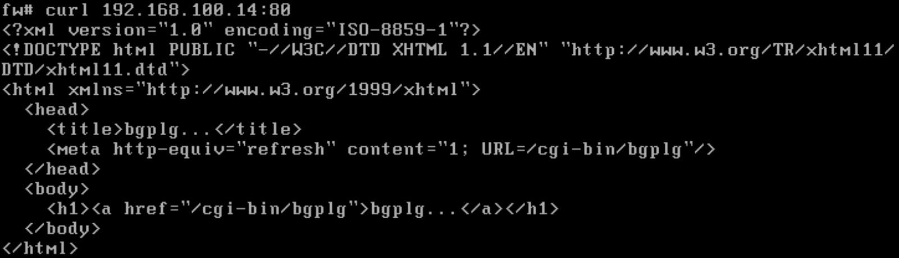

:toc: left

= Test Lab Guide: Open BSD

Michael Pare <michael.pare@mymail.champlain.edu>
version 0.1, 2020-04-15

== Abstract 

This Test Lab Guide (TLG) will provide the user with step-by-step instructions on how to configure a basic network configuration using OpenBSD servers and an OpenBSD client. The resulting test lab environment will provide a stable base for building other test labs. It is recommended that users preserve the start of their test machines once this walk-through has been successfully completed. In a physical environment the hard drive of the machine can be imaged. In a virtual environment, the “snapshot” or equivalent feature can be used to preserve the current state of the operating system. Preserving the working conditions of the basic test lab will allow the user to experiment without fear of having to completely rebuild their environment. The ultimate goal of the TLG is to familiarize the user with the OpenBSD Operating system and how to deploy common network services based on that operating system, and ultimately enable the user to conduct their own experiments in a OpenBSD based environment.

== Introduction

The purpose of the Test Lab Guide (TLG) documentation is to provide users with hands-on experience with current technologies in known working configurations.  Using a TLG will tell you exactly what machines are needed, how they should be configured, and how to install and configure any additional software.  Completing a TLG will allow you to get the entire experience of configuring different technologies from beginning to end.
The purpose of this Test Lab Guide is to guide you in creating a Local Area Network (LAN) using machines running OpenBSD.  Once complete, you will have a LAN that will have the following services:

* Dynamic Host Configuration Protocol (DHCP)
* Domain Name System (DNS)
* HTTP
* NAT (Network Address Translation)
* SMB (Samba)

Once you complete this lab, you may wish to save this initial configuration.  How you save this configuration will depend on how you’ve created and deployed your test environment.  If you are working in a physical environment, you can image the drives of each machine.  If you are working in a virtual environment, you can take snapshots of each machine which will save all the current settings and configurations.  Having a way to preserve the initial functioning base lab configuration is important because it allows you to quickly revert to this state.  This can be helpful when you want a fresh start to test new products or if you make an error.  These images or snapshots will allow you to focus on deploying new technologies successfully instead of having to constantly rebuild this base.  It is because of this that you should image the drives or take snapshots of each machine upon completion of this TLG.

****
Note: If you are completing these TLG’s in a virtual environment using VMWare and have access to an electronic copy of this document, and you have VMWare Tools installed on the Virtual Machine, utilize the ability to copy and paste text from the host machine to the VM.  Copying and pasting will help to reduce typos and command errors.

* Highlight and right-click a command from this document
* Click Copy
* Right-click in the virtual machine where you would like to copy the text to and click Paste
* If you are working inside a terminal, you may only need to right click in order to copy the command over
****
  
== Disclaimer

This website contains work created for informational purposes. Information may be out of date, or changed or updated without notice. By using this website, you recognize and agree that all information is provided “AS IS” without warranty of any kind, either express or implied, including, but not limited to, the implied warranties of merchantability, fitness for a particular purpose, or non-infringement. 

The entire risk arising out of the use of these guides remains with you. IN NO EVENT SHALL CHAMPLAIN COLLEGE, ITS STUDENTS, FACULTY, OR ANYONE ELSE INVOLVED IN THE CREATION, PRODUCTION, OR DELIVERY OF THE GUIDES BE LIABLE TO ANY PERSON FOR ANY DIRECT, INDIRECT, SPECIAL, OR OTHER CONSEQUENTIAL DAMAGES FOR ANY USE OF THE MATERIAL ON THIS WEBSITE. This includes, without limitation, damages for lost profits, business interruption, loss of data or business information, damage to computer equipment or networks, or other loss arising out of the use of any information in the guides.

== Overview of this Test Lab Guide

The OpenBSD TLG is comprised of:

* One server running OpenBSD named DC1 that is configured as the intranet Domain Name System (DNS), and Dynamic Host Configuration Protocol (DHCP) server
* One server running OpenBSD named FIREWALL that has two NIC’s and is configured to act as a router/firewall
* One client running OpenBSD named CLIENT1 that will have the ability to surf the web using Firefox
* One app server for running applications such as smb and http

The OpenBSD Transparent Proxy Server TLG is comprised of one subnet:
* An intranet, known as the Busnet subnet (192.168.100.0/24)
The machines on each of the respective subnets are connected using a physical hub or switch, or a virtual switch. 

=== Network Design

image::networkdiagram.jpg[Network Diagram for OpenBSD Environment, align="center"]

==== Firewall

IP Address: 192.168.100.1/24

Hostname: firewall.college.com

****
The Firewall’s purpose is to handle traffic between the Intranet and Internet. This means that it will act as a router directing traffic. There are two interfaces on Firewall, one is the external/Internet-facing called em0 and the other is the internal/Intranet-facing called em1.
****	

==== DC1

IP Address: 192.168.100.2

Gateway: 192.168.100.1

Hostname: dc1.college.com

****
This will be configured as the Intranet’s Domain Name System (DNS) and the Dynamic Host Configuration Protocol (DHCP) server. 
****
	
==== App1

IP Address: 192.168.100.3

Gateway: 192.168.100.1

DNS Server: 192.168.100.2

Hostname: app1.college.com

****	
This is an internal web and application server. 
****
	
==== Client1

IP Address: Dynamic

DNS Server: 192.168.100.2

Hostname: client1.college.com

****
Client1 is a workstation that has the ability to switch between the Intranet and Internet subnet.
****

=== Hardware and Software Requirements

Minimum requirements:

* Four functioning computers or VMs for configuration with OpenBSD installed.

=== Using “Sudo”

When running many commands throughout these TLGs you may be required to use ‘sudo’ depending on the level of privilege the current user has.  The ‘sudo’ command allows the command following it to be run at superuser privileges.  It is important to note that the user must be in the ‘sudoers’ file in order to successfully use this command.  If you make the account an administrator while installing, it will be added to the ‘sudoers’ file automatically.  Once a command is preceded by ‘sudo’ the user will be prompted for the password for the account and then the command can be run at superuser privilege.  For details on how to give a user ‘sudo’ privilege see the Appendix (How to Give a User to Sudo Privileges).

== Configuring the Environment

=== *Step One - Configuring the Firewall*

The below instructions detail the setup of Firewall.  Here you will give your firewall a hostname, configure it for IP forwarding and set the IP addresses for it two interfaces

. Configure hostname on Firewall
.. Elevate to root
... `su -` 

.. Get nano text installer
... `pkg_add nano` 
+
****
Note: To exit out of nano hit ctrl-x, press y to confirm the changes and press enter. 
****

.. Change the hostname
... `nano /etc/myname`
... Enter the following: `fw.college.com`

. Configure networking on Firewall
.. Enable IP Forwarding
... `echo 'net.inet.ip.forwarding=1' >> /etc/sysctl.conf`
.. Enable DHCP on em0
... `echo 'dhcp' > /etc/hostname.em0`
.. Give internal interface (em1) a static IP
... `echo 'inet 192.168.100.1 255.255.255.0 192.168.100.255' > /etc/hostname.em1`
.. Restart Networking
... `sh /etc/netstart`

=== Configuring NAT 
Here we will configure Network Address Translation so that our internal computers can get to the Internet

. Edit firewall configuration file
.. `nano /etc/pf.conf`
+
****
Note 
In my case em0 was my external interface yours might be different
Same thing for the IP 10.0.2.15, this is my external IP address yours might be different
****
+
.. Add the following line at the bottom of pf.conf:
+
----
match out on em0 from 192.168.100.0/24 to any nat-to 10.0.2.15
pass out on em0 from 192.168.100.0/24 to any nat-to 10.0.2.15
----
.. It should look like this:
+
image::natrules.jpg[Image of nat rules with format, align="center"]
.. Apply changes to firewall
... `pfctl -f /etc/pf.conf`
. Enable IP Forwarding
.. Enable IP forwarding so our internal addresses can reach the internet
... `echo  'net.inet.ip.forwarding=1' >> /etc/sysctl.conf`
.. Add this line if you intend on using IPv6
... `echo  'net.inet6.ip6.forwarding=1' >> /etc/sysctl.conf`
.. Restart your firewall
... `reboot`
. To test this on one of your internal clients see if you can reach an external server
.. `ping 1.1.1.1`
... You should see something like this
+
image::natping.jpg[demonstration of nat in action with ping, align="center"]

=== Snapshot the Configuration 

Preserving a functional state of the machine is important in case changes are made accidently. This can be done using VMWare’s snapshot functionality or other software packages for hardware labs. 

=== *Step Two - Configuring the DC*
The below instructions detail the setup of your domain controller (DC).  Here you will configure DC’s hostname and IP address

. Configure hostname on DC
.. Elevate to root
... `su -` 
+
****
Note: To save and exit in vi mode type :wq
****
.. Change the hostname
... `vi /etc/myname`
... Enter the following: `dc01.college.com`

. Configure networking on DC
.. Set gateway
... `nano /etc/mygate`
... Enter the following: "192.168.100.1"
.. Give your Client an IP address
... `echo 'inet 192.168.100.2 255.255.255.0 192.168.100.255' > /etc/hostname.em0`
.. Restart Networking
... `sh /etc/netstart`

=== Configuring DHCP
Here you will configure dc as a DHCP server for your network to automatically assign addresses

. Configure DHCP on DC
.. Enable DHCP to run at boot
... `rcctl enable dhcpd`
.. Set DHCP flags so that DHCP traffic can be sent out
... `rcctl set dhcpd flags em0`
.. Enter the dhcp file end enter the following information for a DHCP client’s network settings
... `vi /etc/dhcpd.conf`

----
    subnet 192.168.100.0 netmask 255.255.255.0 {
    	option routers 192.168.100.1;
	    option domain-name-servers 192.168.100.2;
	    range 192.168.100.5 192.168.100.254;
    }
----

=== Configuring DNS 
Here Domain Name Services (DNS) will be configured on DC so that computers inside your network can navigate to outside websites via their hostnames

. Enable unbound to run at boot
.. `rcctl enable unbound`

. Edit the unbound configuration file so that it looks like the following
.. `vi /var/unbound/etc/unbound.conf`
+
----
server: 
        interface: 192.168.100.2
        #interface: 127.0.0.1
        access-control: 192.168.100.0/24 allow
        hide-identity: yes
        hide-version: yes

# DNS for Internal LAN
local-zone: "college.com." static

local-data: "firewall.college.com. IN A 192.168.100.1"
local-data: "dc01.college.com. IN A 192.168.100.2"
local-data: "app1.college.com. IN A 192.168.100.3"

local-data-ptr: "192.168.100.1 firewall.college.com"
local-data-ptr: "192.168.100.2 dc01.college.com"
local-data-ptr: "192.168.100.3 app1.college.com"
----
+
image::unboundconf.jpg[configuration for unbound dns, align="center"]
.. After the records add the forward zones in the same file
+
----
forward-zone: 
    name: "."                               #use for ALL queries
    forward-addr: 8.8.8.8@53                #example address only
    forward-addr: 192.168.100.1
    forward-addr: 127.0.0.1@53
    forward-addr: 1.1.1.1@53
    forward-addr: 9.9.9.9@53
----
+
image::forwardzone.jpg[rules for forward zones and ip addresses, align="center"]

. Restart the unbound service
.. `rcctl restart unbound`

. Edit "/etc/resolv.conf" on dc01
.. Edit "/etc/resolv.conf" on dc01 so it looks like this
... `vi /etc/resolv.conf`
+
----
nameserver 8.8.8.8
nameserver 127.0.0.1
----
+
image::localhostnameserver.jpg[Nameserver config on dc1, align="center"]
... You should be able to `ping google.com`

. Edit "/etc/resolv.conf" on any machine using dc01 for DNS
.. Edit "/etc/resolv.conf" so it looks like this
... `vi /etc/resolv.conf`
+
----
nameserver 192.168.100.2
----
+
image::dc1nameserverdns.jpg[namerserver config for dc1 dns, align="center"]
... You should be able to `ping google.com`
+
image::dc1dnsping.jpg[dc1 dns ping example, align="center"]
... And also have successful name resolutions in your LAN
+
image::nslookupdns.jpg[nslookup example for dns, align="center"]

=== Snapshot the Configuration 

Preserving a functional state of the machine is important in case changes are made accidently. This can be done using VMWare’s snapshot functionality or other software packages for hardware labs. 

=== *Step Three - Configuring the Client*
The below instructions detail the setup of Client.  Here you will configure Client’s hostname and IP address

. Configure hostname on Client
.. Elevate to root
... `su -`
.. Change the hostname
... `vi /etc/myname`
... Enter the following: `client1.college.com`

. Configure networking on Client
.. Set gateway
... `nano /etc/mygate`
... Enter the following: "192.168.100.1"
.. Give your Client an IP address
... `echo 'inet 192.168.100.4 255.255.255.0 192.168.100.255' > /etc/hostname.em0`
.. Restart Networking
... `sh /etc/netstart`

=== Configuring Client to use DHCP

Here you will configure DHCP on your clients so that they get their IP Addresses automatically assigned

. Configure DHCP on Client
.. Enable DHCP to run at boot
... `rcctl enable dhcpd`
.. Set DHCP flags so that DHCP traffic can be sent out
... `rcctl set dhcpd flags em0`
.. Write to the networking file dhcp so client receives an address from dc01
... `echo “dhcp” > /etc/hostname.em0`
... `sh /etc/restart`
.. You should get a message saying you received an ip address:
+
image::dhcpleaseaccept.jpg[Message for dhcp lease accepted, align="center"]
.. If you don’t then rebooting your machine might get you an address
... reboot

=== Snapshot the Configuration 

Preserving a functional state of the machine is important in case changes are made accidently. This can be done using VMWare’s snapshot functionality or other software packages for hardware labs. 

=== *Step Four - Configure App1*

The below instructions detail the setup of your application server.  Here you will configure app1’s hostname and IP address

. Configure hostname on App1
.. Elevate to root
... `su -` 
.. Change the hostname
... `vi /etc/myname`
... Enter the following: `app1.college.com`

. Configure networking on App1
.. Set gateway
... `nano /etc/mygate`
... Enter the following: "192.168.100.1"
.. Give your Client an IP address
... `echo 'inet 192.168.100.3 255.255.255.0 192.168.100.255' > /etc/hostname.em0`
.. Restart Networking
... `sh /etc/netstart` 

=== Configuring HTTPD 

Here app1 will be configured so that it runs an apache (httpd) web server

. Enable httpd to start at boot
.. `rcctl enable httpd`

. Copy example httpd.conf file to "/etc" directory
.. `cp /etc/examples/httpd.conf /etc`

. Delete SSL configurations from "httpd.conf"
.. `vi /etc/httpd.conf`
.. Navigate to where the configuration for ssl starts, might look something like this:
+
image::ssldelete.jpg[picture of what is going to be deleted for ssl, align="center"]
.. In vi make sure your curso is above the tls settings like this
+
image::ssldeletecursor.jpg[cursor position for the command to delete the ssl configs, align="center"]
.. To get rid of all lines below where your cursor is do
... `:+,$d`
. Check for syntax errors in file
.. `httpd -n`
.. If there are no errors then start the service
 Start the service
.. `rcctl start httpd`
 Check to see if you get a response from your firewall
.. `pkg_add`
.. `curl “192.168.100.3”`
.. You should get back something like this:
+
image::curlssl.jpg[curl example to test the ssl, align="center"]
. Edit app1’s firewall to allow port 80 traffic and restart the firewall
.. If you want this webserver to be viewed by the outside word 
.. `nano /etc/examples/pf.conf`
.. Add pass in on egress proto tcp from any to any port 80
.. `pfctl -f /etc/examples/pf.conf`
. Edit firewall
.. `nano /etc/examples/pf.conf`
.. pass in on egress proto tcp from any to any port 80
.. `pfctl -f /etc/examples/pf.conf`
.. `nano /etc/rc.conf.local`
. Got back to App1 and allow for http flags
.. `nano /etc/rc.conf.local`
.. `httpd_flags=`
.. `pkg_scripts=”httpd”`
. Test connection on firewall
.. `curl “192.168.100.3”`

You should see the following: 
+

=== Configuring SMB

Here app1 will be configured to host a samba server that can be used to share files across your network from multiple different computers

. Download SMB
.. `pkg_add samba`
. Enable SMB to start at boot
.. `rcctl enable smbd nmbd`
. Edit the Configuration file if you want
.. `vi /etc/samba/smb.conf` (you can use previous config)
. Create a directory for SMB service
.. `mkdir -p /home/samba`
. Change permission to nobody so that multiple people can get to the shares
.. `chown nobody:nobody /home/samba`
. Start the service
.. `rcctl start smbd nmbd`

=== Snapshot the Configuration 

Preserving a functional state of the machine is important in case changes are made accidently. This can be done using VMWare’s snapshot functionality or other software packages for hardware labs. 

== Troubleshooting

To test network connectivity run `ping 8.8.8.8`. If it fails, run `ping 192.168.100.1` to see if you can ping the router. If you can’t ping the router make sure your computer is on the correct network. If you can but you can’t reach 8.8.8.8, make sure the computer has an ip address and that NAT is working properly. 

If you look up any error codes or messages you are getting, most of the time someone has ran into the same problem and you can find the solution.  

If you run `ping google.com` and it fails but you can `ping 8.8.8.8` then the problem is with your DNS configuration. 

== Contributors

* Brandon Ledyard
* Michael Pare
